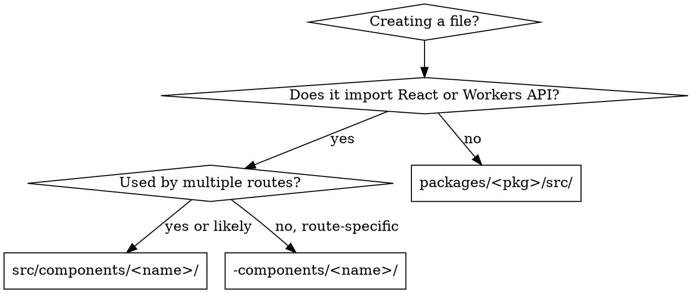

# File Colocation

## Overview

Every file has a home. Styles live next to their component. Route-specific components colocate under `-components/`. Reusable components live in `apps/<app>/src/components/`. Framework-free logic lives in `packages/`.

TanStack Start builds its route tree from `src/routes/`, ignoring any entry whose name starts with `-`. That is why route-local components use `-components/` rather than `_components/`.

## The Rule

```
<route>.tsx           → <route>.styles.css.ts   (route styles)
route-local component → -components/<name>/     (used by one route)
shared component      → src/components/<name>/  (used across routes)
framework-free logic  → packages/<pkg>/src/     (no React, no Workers API)
```

## Directory Structure

```
apps/web/src/
  routes/
    b.$bucketId.$.tsx                   # route component
    b.$bucketId.$.styles.css.ts         # Panda CSS for the route
    -components/
      object-list/
        index.tsx                       # component implementation
        styles.css.ts                   # component styles
        object-list.test.tsx            # component tests
      upload-tray/
        index.tsx
        styles.css.ts
        upload-tray.test.tsx
  components/
    file-icon/
      index.tsx                         # reusable across routes
      styles.css.ts
      file-icon.test.tsx
  plugins/
    file-type/
      registry.ts                       # ordered list — order carries meaning
      types.ts
      image/
        index.tsx
        image.test.ts

packages/core/src/
  create-runner.ts
  create-runner.test.ts
```

## Decision Flowchart



Pure logic goes to `packages/` even when only one app uses it today — the package boundary is what keeps a future Worker split possible.

## styles.css.ts Pattern

Extract Panda CSS styles into a colocated `.css.ts` file. The component file imports named exports.

```ts
// styles.css.ts
import { css } from '@styled/css';
import { grid } from '@styled/patterns';

export const listRoot = css({ maxW: '6xl', mx: 'auto', p: '8' });
export const listHeading = css({ fontSize: '4xl', fontWeight: 'bold' });
export const listGrid = grid({ columns: { base: 1, md: 3 }, gap: '6' });
```

```tsx
// b.$bucketId.$.tsx
import * as s from './b.$bucketId.$.styles.css.ts';

export const RouteComponent = () => (
  <main className={s.listRoot}>
    <h1 className={s.listHeading}>Objects</h1>
    <div className={s.listGrid}>{/* ... */}</div>
  </main>
);
```

## The Three-File Rule

Every component directory MUST have exactly three files. No exceptions.

```
<name>/
  index.tsx        # component implementation (required)
  styles.css.ts    # all Panda CSS styles (required, even if small)
  <name>.test.tsx  # tests (required, at minimum a render test)
```

Missing any of these three files is a violation. Create all three when creating a component directory.

## Plugin Directory Pattern

Plugin directories are the one exception to the three-file rule — they have no styles of their own unless they ship a component.

```
plugins/file-type/
  types.ts            # the Processor<I, O> instantiation
  registry.ts         # ordered array — specific before broad
  image/
    index.tsx         # the plugin: `run(descriptor)` + lazy Viewer
    image.test.ts     # calls run() directly, never through the runner
```

Never add a plugin by editing a `switch` or an `if` chain in the dispatcher — write the plugin file, add one line to `registry.ts`.

## Red Flags — STOP and Restructure

- Inline `css()` calls growing beyond ~5 in a single component file → extract to `styles.css.ts`
- Sub-component functions defined in a route file → move to `-components/<name>/`
- A component in `-components/` imported from another route → move to `src/components/`
- A route file exceeding ~80 lines → split components out
- Anything in `packages/` importing React, `react-aria-components`, or a Workers global → it belongs in `apps/`
- `@r2-drive/api` (the Hono app value) imported outside `apps/web/src/worker.ts` → import `@r2-drive/api/client` instead; the direct import breaks the future Worker split

## Common Mistakes

| Mistake                                        | Fix                                          |
| ---------------------------------------------- | -------------------------------------------- |
| All components in the route file               | Split into `-components/<name>/index.tsx`    |
| Using `_components/` instead of `-components/` | TanStack Start only ignores `-` prefixes     |
| Styles inline in component                     | Extract to colocated `styles.css.ts`         |
| Route-specific component in `src/components/`  | Move to `-components/`                       |
| Missing test file                              | Add `<name>.test.tsx` alongside `index.tsx`  |
| Component directory without `styles.css.ts`    | Always create even if small                  |
| Pure logic placed in `apps/`                   | Move to `packages/core/` or `packages/api/`  |
